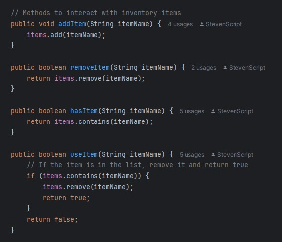
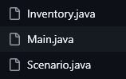

## Author: Steven Norris

---

# Inventory Project (CLI Version)

## Overview

This is a **simple Java CLI application** that demonstrates an **inventory system** and a **basic puzzle scenario**:

- The player can **pick up**, **drop**, and **use** items (like a *potato*, *flashlight*, or *key*).  
- Using the **flashlight** reveals a **door**.  
- The **door** can’t be picked up, but it can be **unlocked** if the flashlight was used first.  
- Once unlocked, the scenario ends (the player escapes the “spooky room”).

**No GUI** is required—everything happens in the **command-line interface** (CLI).  

## Features

1. **Inventory System**  
   - Add items, remove items, check if an item is present, and “use” an item.  
   - The `Inventory.java` class provides these methods.

2. **Puzzle/Scenario Logic** (`Scenario.java`)  
   - Prevent picking up the door.  
   - Let the flashlight reveal the door.  
   - Only let the key unlock the door if it’s revealed.  
   - Mark the scenario “finished” once the door is unlocked (i.e., the user has escaped).

3. **Interactive CLI** (`Main.java`)  
   - Prompts the user for commands (`pick <item>`, `drop <item>`, `use <item>`, or `quit`).  
   - Parses and runs them against the scenario logic.  
   - Ends the game when the door is unlocked or the user chooses `quit`.

## Project Structure


```
SDAT-DEVOPS-QAP1-HorrorInventoryProject
├── README.md                <-- This file (documentation)
├── pom.xml                  <-- Maven configuration
├── src
│   ├── main
│   │   └── java
│   │       └── com
│   │           └── InventoryProject
│   │               ├── Inventory.java
│   │               ├── Scenario.java
│   │               └── Main.java
│   └── test
│       └── java
│           └── com
│               └── InventoryProject
│                   ├── InventoryTest.java
│                   └── ScenarioTest.java
└── .github
    └── workflows
        └── maven.yml        <-- GitHub Actions CI
```

- **`Inventory.java`**  
  Core inventory logic (add/remove/use).  
- **`Scenario.java`**  
  Puzzle state (door hidden/unlocked, finishing scenario).  
- **`Main.java`**  
  CLI to interact with the puzzle.  
- **Tests**  
  - `InventoryTest.java` checks that inventory operations work.  
  - `ScenarioTest.java` tests puzzle logic (flashlight reveals door, key unlocks door, etc.).

## How to Build & Run

### Prerequisites
- **Java 17** (or a compatible JDK).  
- **Maven** 3.6+ (optional if you have an IDE that supports Maven).

### Compile & Test

1. **Clone** or **Download** the repository.  
2. From the project root (where `pom.xml` is), run:

   ```bash
   mvn clean test
   ```
   - **`mvn clean`** removes old build files.
   - **`mvn test`** compiles the source code, compiles the tests, and then runs all tests in `src/test/java/...`.

You should see **BUILD SUCCESS** if all tests pass.

### Run the CLI Application

For easiest access, run `Main.java` from your IDE’s run button

## How It Works (Logical Flow)

1. **User Input**: In `Main.java`, a `Scanner` reads commands like “pick potato” or “use key.”  
2. **Scenario Methods**: 
   - `pickItem(itemName)`: returns `false` if it’s “door,” otherwise adds to the `Inventory`.  
   - `dropItem(itemName)`: removes it from your `Inventory`.  
   - `useItem(itemName)`: 
     - If it’s **flashlight**, `doorRevealed = true`.  
     - If it’s **key** and `doorRevealed` is true, it sets `doorUnlocked = true` and `finished = true`.  
     - For anything else (like a “potato”), it just removes it from inventory with no special effect.  
3. **Ending the Scenario**: Once `finished = true`, `Main.java` breaks out of the while loop, printing a success message that the door is unlocked.  

## TDD (Test-Driven Development) Approach

- I wrote **`ScenarioTest.java`** and **`InventoryTest.java`** *first*, each describing the expected behavior (e.g., “picking door should fail,” “using flashlight reveals door,” “once door is unlocked, scenario is finished”).  
- I then implemented each piece of code until tests passed.  
- The final CLI (`Main.java`) was added on top of that logic and tested manually.

## Clean Code & Comments

- **Descriptive Method Names**: `pickItem`, `dropItem`, `useItem` clearly convey their functions.
- **Small, Focused Methods**: Each case is short and understandable. Methods like pickItem and dropItem are likewise limited to one responsibility. They don’t do multiple, unrelated things in the same block of code.
- - 
  
- **Single Responsibility**: `Scenario` handles puzzle rules. `Inventory` handles item storage. `Main` deals with user input.
-    

## Continuous Integration (CI) with GitHub Actions

- Each push or pull request triggers the **Maven build** and **test** steps (defined in `.github/workflows/maven.yml`).  
- If any test fails, GitHub marks the workflow as failed, indicating potential regressions.

## Possible Extensions

- Add more items with unique logic.  
- Track a limited inventory capacity.  
- Create multiple rooms or puzzles.  
- Store item usage counts.  


## License and Contributions

- This is a sample/learning project for SDAT/DevOps practice.  
- Feel free to modify and adapt for educational or personal use.  

---
